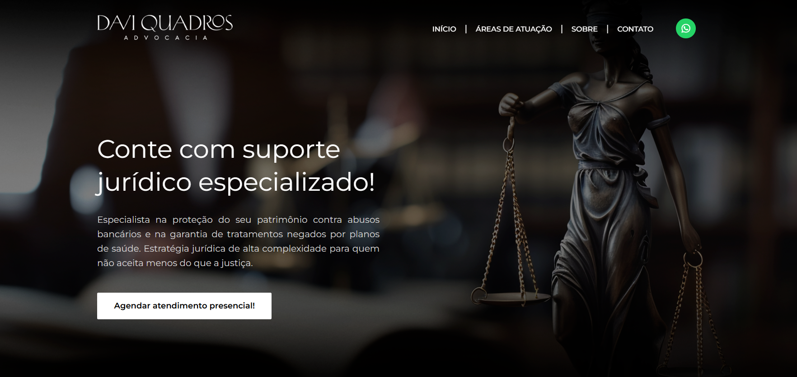

<h1 align="center">
  Davi Quadros Advocacia | Landing Page Institucional
</h1>

  <a href="#-o-projeto">O Projeto</a>&nbsp;&nbsp;&nbsp;|&nbsp;&nbsp;&nbsp;
  <a href="#-funcionalidades">Funcionalidades</a>&nbsp;&nbsp;&nbsp;|&nbsp;&nbsp;&nbsp;
  <a href="#%EF%B8%8F-tecnologias-e-arquitetura">Tecnologias</a>&nbsp;&nbsp;&nbsp;|&nbsp;&nbsp;&nbsp;
  <a href="#-uiux--design">Design</a>&nbsp;&nbsp;&nbsp;|&nbsp;&nbsp;&nbsp;
  <a href="#-status-e-deploy">Deploy</a>

  
  
  
  

 

  

 

## 🎯 O Projeto

Landing Page de alta conversão desenvolvida para o escritório **Davi Quadros Advocacia**. O objetivo do projeto foi criar uma presença digital autoritária e elegante, transmitindo confiança para clientes de alta complexidade nas áreas de Proteção Patrimonial, Direito Bancário e Saúde.

A arquitetura do site foi pensada para reduzir o atrito de comunicação, guiando o usuário de forma fluida até o contato direto via WhatsApp, através de gatilhos visuais e chamadas para ação (CTAs) estratégicas.

## 🚀 Funcionalidades

O projeto conta com diversas implementações técnicas focadas em Experiência do Usuário (UX) e Performance:

- **Navegação Inteligente:** Menu fixo (Sticky Header) com alteração dinâmica de opacidade via Scroll e menu Hambúrguer interativo para dispositivos móveis.
- **Scroll Suave (Smooth Behavior):** Âncoras internas que deslizam suavemente até as seções correspondentes.
- **Intersection Observer API:** Animações de entrada (Fade-in) ativadas dinamicamente apenas quando a seção entra no campo de visão (Viewport), poupando processamento.
- **Lógica de Botão Flutuante:** O botão do WhatsApp acompanha a rolagem no celular, mas oculta-se automaticamente (Fade-out) ao atingir o rodapé de contato para evitar sobreposição de elementos.
- **Conformidade LGPD:** Banner nativo de aceite de cookies integrado com `localStorage` para memorizar a escolha do usuário, além de página dedicada à Política de Privacidade.
- **Otimização de Assets:** Uso de imagens nativas com `loading="lazy"` para otimização de SEO e ícones escaláveis (SVG / FontAwesome) que garantem nitidez absoluta em telas Retina/4K.

## 🛠️ Tecnologias e Arquitetura

O projeto foi construído sem o uso de frameworks pesados, priorizando velocidade e controle total do DOM.

- **HTML5:** Estrutura altamente semântica (`<header>`, `<main>`, `<section>`, `<article>`), com tags otimizadas para acessibilidade (`aria-labels`).
- **CSS3 (Vanilla):** - Utilização de **Custom Properties (Variáveis)** para manutenção rápida do Theme (Cores, Fontes e Tamanhos).
  - Layouts complexos construídos com **CSS Grid** e **Flexbox**.
  - Responsividade _Mobile-First_ através de Media Queries milimétricas.
- **JavaScript (ES6+):** Script modular, limpo e direto.

## 🎨 UI/UX & Design

O projeto visual foi idealizado e construído por **Carolina ALves**.

- **Paleta de Cores:** Foco no _Dark Theme_ com contrastes em tons claros, fugindo do padrão saturado tradicional e focando em uma identidade visual "Premium/Boutique".
- **Tipografia:** Uso da família _Montserrat_ (Google Fonts) para garantir leiturabilidade e elegância em títulos e parágrafos.

## 🌐 Status e Deploy

O projeto encontra-se **Finalizado** e hospedado através da plataforma Vercel.

🔗 **[Acessar o site ao vivo](https://davi-araujo-quadros.vercel.app/)**

---

  Desenvolvido com dedicação por <strong>José William</strong> e <strong>Carolina Alves</strong>. 
  © 2026 - Todos os direitos reservados.

